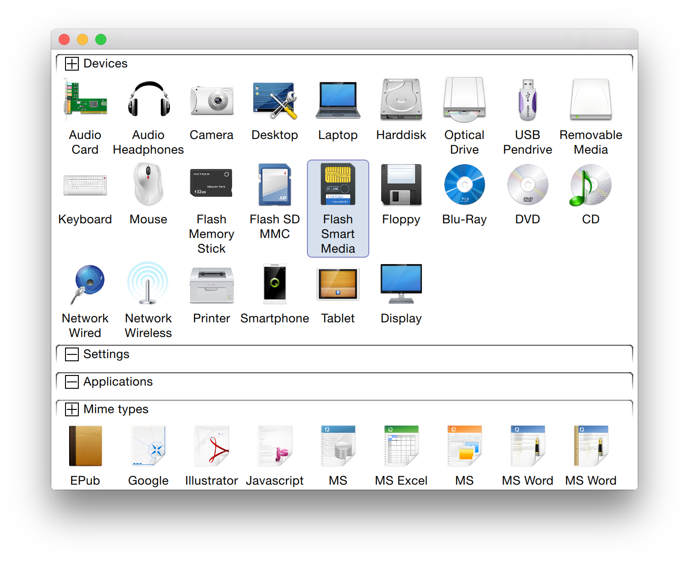

# GroupView [](https://travis-ci.org/MultiMC/MultiMC5)

This project provides a GroupView (like can be seen in OS settings overview dialogs and similar) for usage with QtQuick.

The current main use-case is for desktop, but it should also work on mobile.



Current features include:

* Uses a standard QAbstractItemModel derived tree
* Easily stylable in the same way as the vanilla ListView and friends
* Animations!
* Drag & Drop (_in progress_)
* Made available under the permissive Apache License 2.0

## Usage

A fully working example application is included, see [here](https://github.com/02JanDal/GroupViewQML/tree/master/example).

```qml
import QtQuick 2.0
import xyz.jandal.groupview 1.0

...

GroupView {
    anchors.fill: parent
    model: myModel

    headerComponent: Item {
        height: 25
        Rectangle {
            anchors.left: parent.left
            anchors.verticalCenter: parent.verticalCenter
            height: 10
            width: 10
            color: expanded ? "black" : "white"

            MouseArea {
                anchors.fill: parent
                onClicked: expanded = !expanded
            }
        }
        Text {
            text: name
            anchors.centerIn: parent
        }
    }

    itemComponent: Item {
        height: image.height + text.height + text.anchors.topMargin

        Image {
            id: image
            source: decoration
            anchors.horizontalCenter: parent.horizontalCenter
            anchors.top: parent.top
            width: 50
            height: 50
        }

        Text {
            id: text
            text: display
            anchors.left: parent.left
            anchors.right: parent.right
            anchors.top: image.bottom
            anchors.topMargin: 5
            width: parent.width
            wrapMode: Text.WordWrap
            horizontalAlignment: Text.AlignHCenter
        }
    }
}

...
```

Further properties in `GroupView`:

* `itemWidth` (int)
* `itemPadding` (int)
* `itemMove`, `itemAdd`, `itemPopulate` (Transition)

### ScrollBar

For desktop users a mouse wheel for scrolling is not guaranteed. For that reason a generic ScollBar component that can be used with any `Flickable` (like `GroupView`) is included.
See the example application for how to use it.

## Contributing

Normal GitHub procedure:

1. Fork on Github
2. Clone your fork locally
3. Edit code (preferably in a branch)
4. Commit and push your changes to your fork
5. Open a PR (pull request) on Github
6. Until it's merged: interact with any questions that come up, make changes and push again if required.

Please use the same coding style as used throughout the rest of the project.
